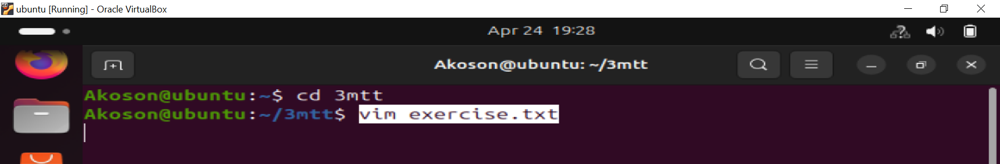
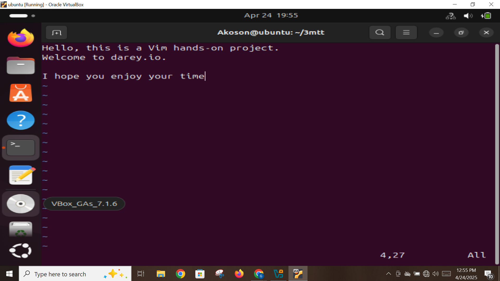
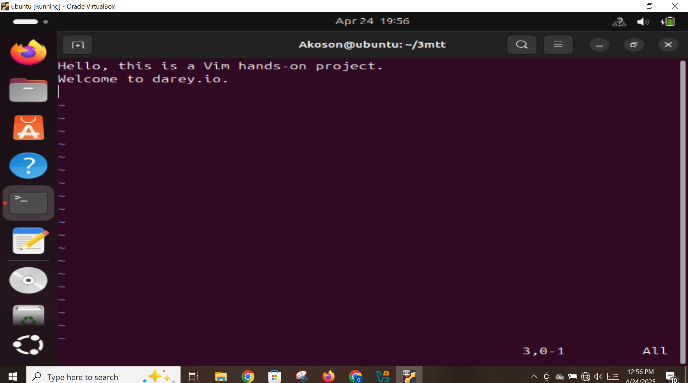
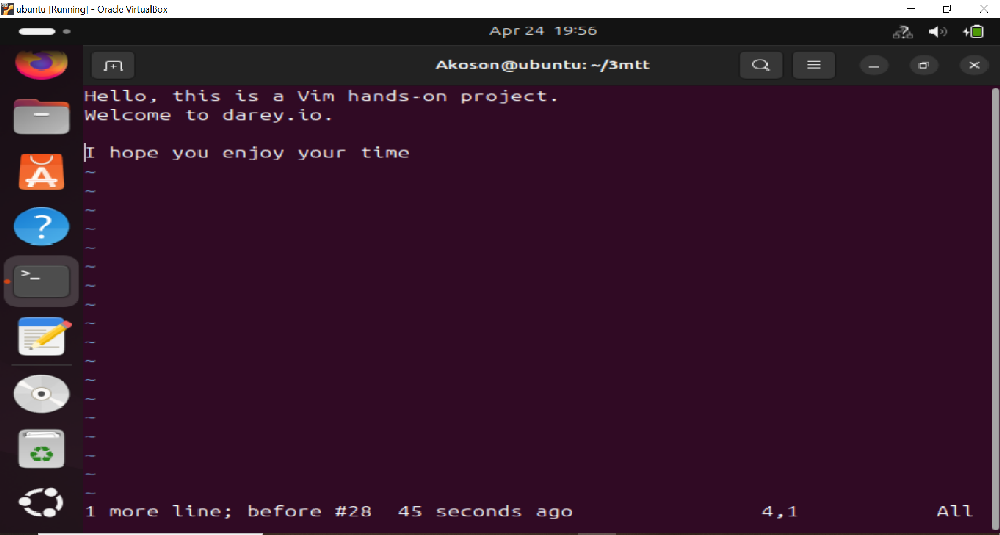
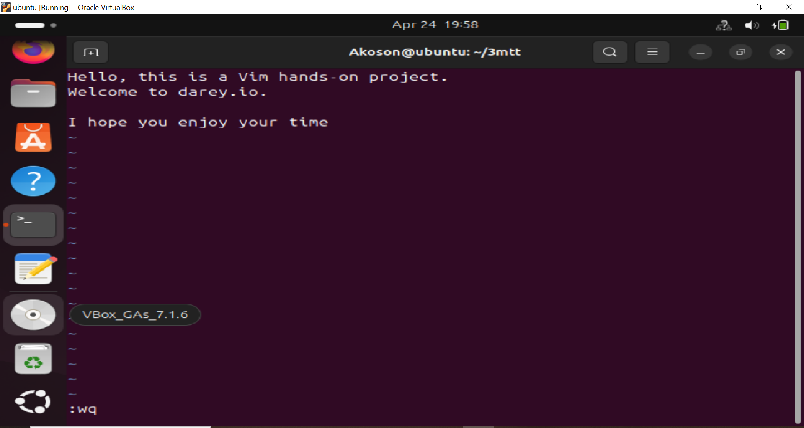
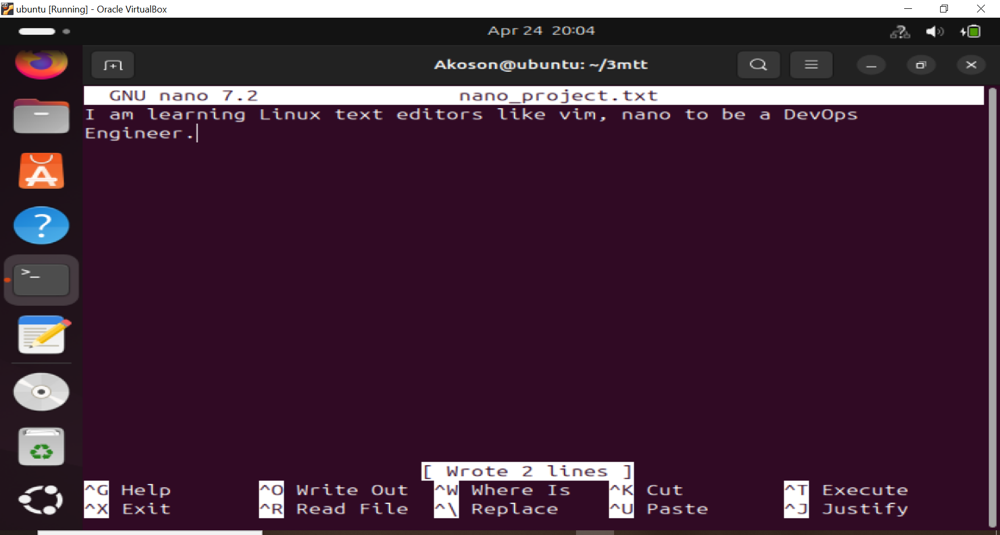
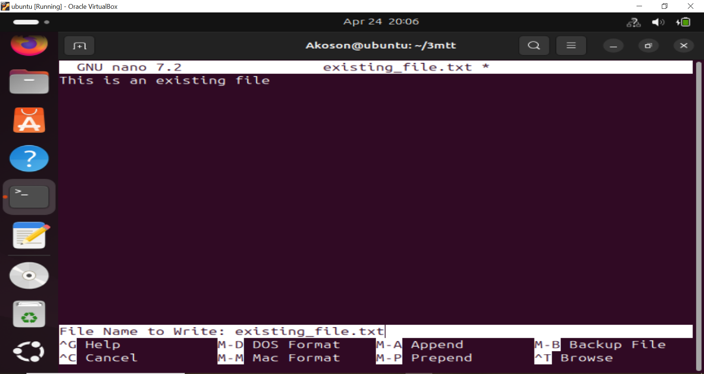
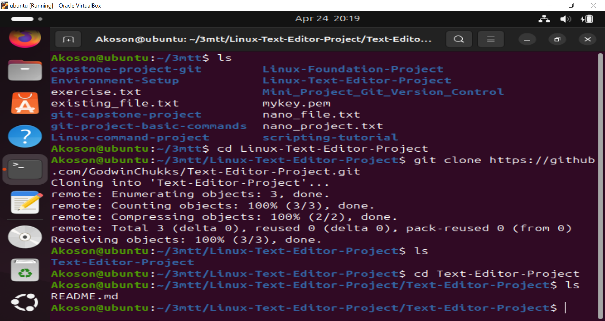
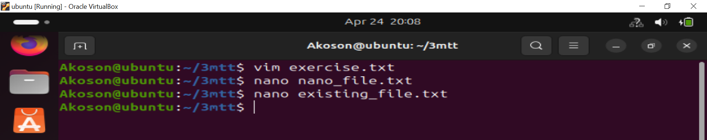

# Text-Editor-Project
## This project demonstrates Linux text editor such as vim and nano 

## LINUX TEXT EDITORS

## Linux text editors are tools used to create and modify text files, including configuration files, scripts, code, and notes. They are essential for system administration, programming, and general file editing. In this project we are going to explore two most popular text editors which are vim and nano.

## vim TEXT EDITOR

## vim (Vi IMproved) is a highly efficient and powerful text editor used in the Linux terminal. It's an enhanced version of the classic vi editor, designed for programmers and power users who need speed, flexibility, and extensive editing capabilities.

## Key Features:
- Modal editing – Operates in different modes:

- Normal mode (navigation/commands)

- Insert mode (typing text)

- Visual mode (selecting text)

- Command-line mode (saving, searching, quitting, etc.)

- Syntax highlighting, auto-completion, search and replace, macros, and plugins.

- Very lightweight and available by default on most Linux systems.

## Basic Commands:

- Press i → to enter Insert mode

- Type your text
Press Esc → to return to Normal mode

- Type :w → to save, :q → to quit, or :wq → to save and quit

## SUMMARY

## Though it has a learning curve, mastering vim can significantly boost productivity in coding, system configuration, and remote editing via SSH.

## Screenshot demostrating creation of file using Linux vim command.

## Screenshot showing vim in insert mode

## Screenshot showing how to delete a character after exiting insert mode. 

## press esc key on the keyboard to exit the insert mode. Then positioning the cursor on a character you want to delete and prssing x

## Screenshot showing how to delete a line after exiting insert mode. 

## To delete a line in the file press the esc key on the keyboard to exit the insert mode, then place the cursor on a line and press d twice on your keyboard to delete the entire line

## Screenshot show how to undo changes. After making changes in insert or normal mode then press esc key to be in normal mode and press u to undo the last changes.

## Saving changes after writing into the file press esc. then type :wq and press Enter. This will save the file. w means write and q means quit which quits the vim mode and return to the terminal.

## nano TEXT EDITOR

## nano is a simple, user-friendly text editor for the command line in Linux. It's ideal for beginners and quick edits, offering an intuitive interface with visible command shortcuts at the bottom of the screen.

## Key Features:

- Easy to use with on-screen help.

- Supports basic editing like cut, copy, paste, and search.

- No complicated modes (unlike vim).

- Perfect for editing config files and small scripts.

## Editing file with nano screenshot

- Type to edit the file.

- Press Ctrl + O to save (then press Enter).

- Press Ctrl + X to exit.

## Opening an existing file with nano

## Text editing commands used screenshot

